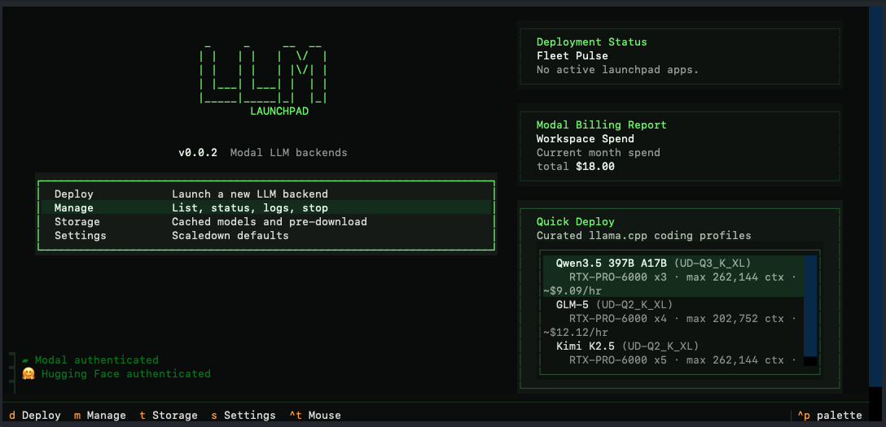

<h1 align="center">LLM-Launchpad</h1>
<p align="center">Spin up LLM endpoints on Modal for local and personal use</p>
<p align="center">
  
</p>

- Deploy any open-source models from the HuggingFace model hub.
- Open-AI compatible endpoints via llama.cpp (preferred) and vLLM backends.
- Direct integration with [OpenCode](https://github.com/anomalyco/opencode).

## Prerequisites
- **uv** for Python, environment, and CLI tool management (install with `curl -LsSf https://astral.sh/uv/install.sh | sh`)
- **Modal account**
- **Hugging Face account**
- Optional: [OpenCode](https://github.com/anomalyco/opencode) (install with `curl -fsSL https://opencode.ai/install | bash`)

## Quickstart

Get up and running in four steps:

1. Install the CLI so `llm-launchpad` is available in your shell:
   ```bash
   uv tool install llm-launchpad
   llm-launchpad --help
   ```

2. Authenticate Modal:
   ```bash
   modal setup
   ```

3. Authenticate Hugging Face:
   ```bash
   huggingface-cli login
   ```

4. Launch the TUI:
   ```bash
   llm-launchpad
   ```

## Why a TUI?

Setting up LLM endpoints usually means juggling model names, container images, GPU choices, warmup checks, logs, and endpoint details across several commands. The TUI keeps that flow in one place.

From the TUI you can:
- Launch any open-source model on the Hugging Face model hub without memorizing Modal or backend-specific commands
- Manage multiple deployed instances and inspect their status
- Integrate the final OpenAI-compatible base URL and model ID into your workflows like OpenCode after deployment.

## OpenCode integration

LLM-Launchpad automatically detects local installation of OpenCode and will setup your OpenCode config with the final OpenAI-compatible base URL and model ID after deployment.

## Development setup

If you are working from a clone and want the command available directly while editing the source:
```bash
git clone https://github.com/ThomasRochefortB/llm-launchpad.git
cd llm-launchpad
uv tool install --editable .
llm-launchpad --help
```

If you need the full project environment for tests or local development workflows:
```bash
uv sync
uv run pytest
```
